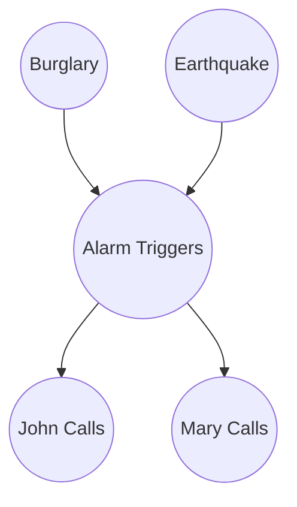

# Bayesian Network DAG

This Directed Acyclic Graph (DAG) represents the conditional dependencies in a classic Bayesian Network. Notice how the arrows (edges) flow in one direction without ever looping back on themselves—hence "Directed" and "Acyclic".

