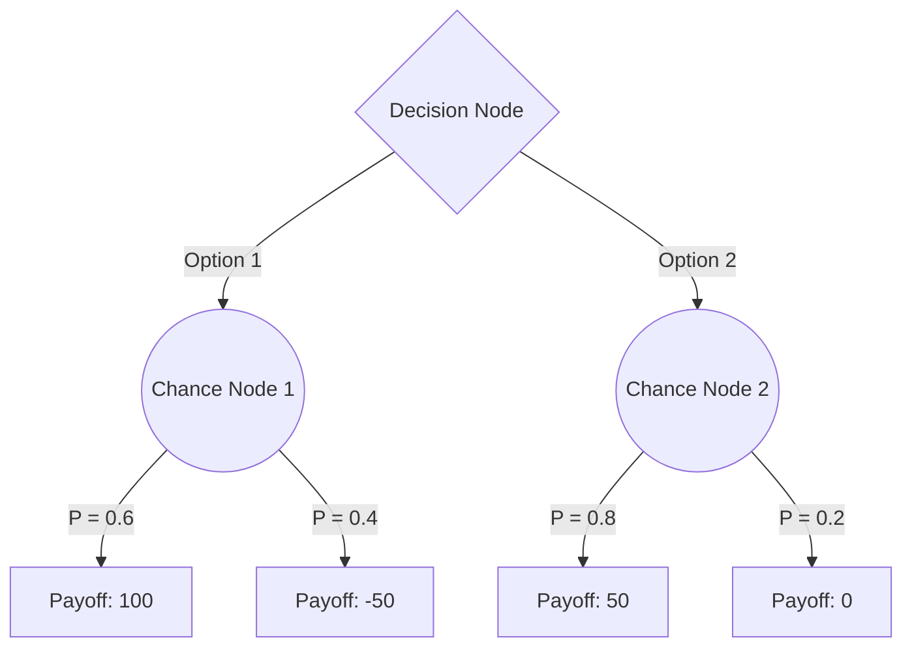

# Simple Decision Tree

Here is a visual representation of a basic decision tree:

```mermaid
graph TD
    A{Decision Node} -->|Option 1| B((Chance Node 1))
    A -->|Option 2| C((Chance Node 2))
    
    B -->|P = 0.6| D[Payoff: 100]
    B -->|P = 0.4| E[Payoff: -50]
    
    C -->|P = 0.8| F[Payoff: 50]
    C -->|P = 0.2| G[Payoff: 0]
```
