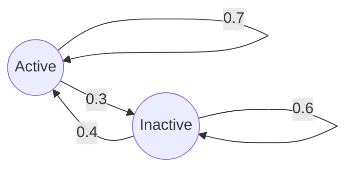

# Markov Chain State Diagram

This diagram visualizes a two-state Markov Chain (Active vs. Inactive) and the transition probabilities between them.

```mermaid
graph LR
    A((Active)) -->|0.7| A
    A -->|0.3| B((Inactive))
    
    B -->|0.4| A
    B -->|0.6| B
```
