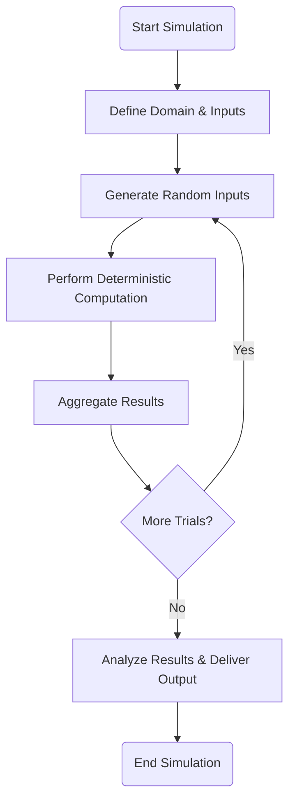

# Monte Carlo Process Flow

A Monte Carlo simulation is an iterative process. This diagram visualizes how the simulation loops through repeated random sampling to arrive at a numerical result.

```mermaid
graph TD
    Start(Start Simulation) --> Input[Define Domain & Inputs]
    Input --> Loop[Generate Random Inputs]
    Loop --> Perform[Perform Deterministic Computation]
    Perform --> Aggregate[Aggregate Results]
    Aggregate --> Check{More Trials?}
    Check -- Yes --> Loop
    Check -- No --> Analyze[Analyze Results & Deliver Output]
    Analyze --> End(End Simulation)
```
