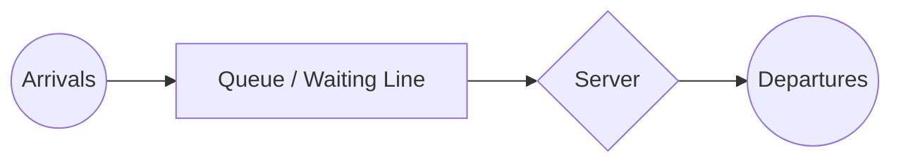

# Basic Queue Diagram

This diagram represents a simple single-server queuing system, showing the flow of entities from arrival to departure.

```mermaid
graph LR
    A((Arrivals)) --> B[Queue / Waiting Line]
    B --> C{Server}
    C --> D((Departures))
```
